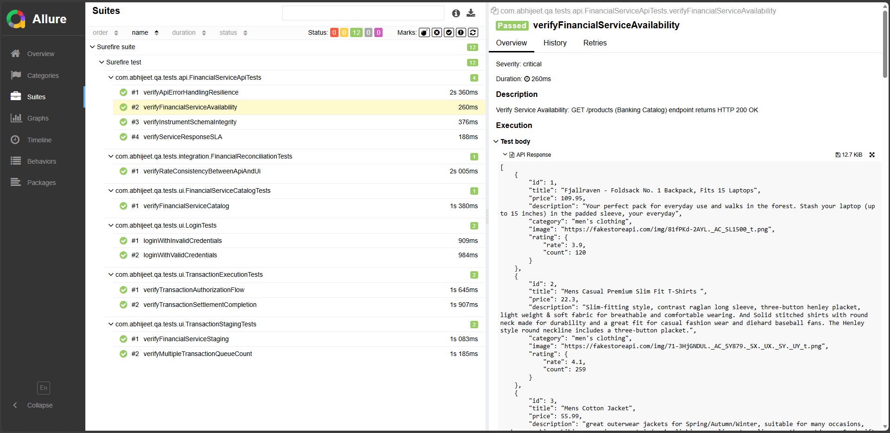

[](https://95abhijeet.github.io/Fintech-Quality-Assurance-Automation-Framework-for-Transaction-Reconciliation/)


# Fintech Quality Assurance: Automation Framework for Transaction & Reconciliation

## Overview
This is a **comprehensive QA automation framework** designed for the rigorous demands of **Banking and Fintech ecosystems**.
It ensures the reliability of complex financial workflows across Web UI, RESTful Microservices, and Backend Data layers.

> **Note**: The framework is built to be Application Agnostic.
While the current implementation uses a Retail/E-commerce environment as a public testbed, 
the underlying architecture is designed to handle the complex JSON schemas 
and state-machine transitions typical of Banking APIs.

By leveraging **Java 22, Playwright, and RestAssured**, this framework provides a "Digital Assurance" layer that validates:

- **Transaction Integrity**: Ensuring data consistency between Frontend UI and Backend APIs.
- **Security Protocols**: Validation of secure headers, session handling, and API status codes.
- **Regulatory Readiness**: Automated audit-ready reporting via Allure.

The framework is designed for **end-to-end testing** of web applications, including:

- **UI Tests**: Functional and data-driven validation of web pages.
- **API Tests**: REST API validation with request/response checks.
- **Integration Tests**: Data consistency validation between backend APIs and UI layers.

---

## Tech Stack

| Layer                         | Technology                                    |
|-------------------------------|-----------------------------------------------|
| Language                      | Java 22                                       |
| Digital UI Automation         | Playwright (Cross-browser / High Concurrency) |
| API Testing                   | RestAssured, JSON Path                        |
| Test Framework                | TestNG                                        |
| Compliance Reporting          | Allure Reports (Audit-ready logs)             |
| Build & Dependency Management | Maven                                         |
| CI/CD                         | GitHub Actions                                |

---
## Why This Framework for Banking?
In a financial context, a failure in data consistency isn't just a bug—it's a risk.
This framework demonstrates:
- **Zero-Trust Validation**: API + UI cross-referencing in a single execution.
- **Atomic API Testing**: Independent microservice validation using RestAssured. 
- **Decoupled Architecture**: Separation of Test Logic, Page Objects, and Environment Data.
- **Cross-Browser Resilience**: Multi-browser support (Chromium, Firefox, Webkit) powered by Playwright.
- **Audit-Ready Reporting**: Detailed step-by-step execution logs and screenshots for every test case.


---
## Project Structure
```
cloud-native-qa-automation-framework
│
├── src
│   ├── test
│   │   ├── java
│   │   │   ├── api
│   │   │   │   └── FinancialServiceApiTests.java
│   │   │   ├── ui
│   │   │   │   ├── LoginTests.java
│   │   │   │   ├── FinancialServiceCatalogTests.java
│   │   │   │   ├── TransactionExecutionTests.java
│   │   │   │   └── TransactionStagingTests.java
│   │   │   └── integration
│   │   │       └── FinancialReconciliationTests.java
│   │   └── resources
│   └── main
│
├── target
│   ├── allure-results
│   └── site
│       └── allure-maven-plugin
│
├── .github
│   └── workflows
│       └── qa-automation.yml
│
├── pom.xml
└── README.md
```
---

## Test Coverage (Banking Context)

🔹 **API Tests**
- Service availability and endpoint resilience. 
- Secure HTTP status code verification (Auth/Unauth states). 
- Field validation for financial payloads. 
- Negative testing for "Invalid Transaction" scenarios.

🔹 **UI Tests**
- UI flow validation using Playwright
- Browser-based functional checks
- Cross-browser resilience using Playwright.
- Headless execution for CI

🔹 **Data Integrity (E2E)**
- Reconciliation: Comparing account balances/transaction data shown on the UI against the API source of truth. 
- End-to-End Audit: Validating backend state changes after UI-triggered events.
---

## Running Tests Locally

1. **Prerequisites**

    Make sure you have:

   - Java 22 (LTS-ready configuration)
   - Maven 3.9+
   - Node.js 18+ (for Playwright)
   - Git

2. **Install dependencies**
    ```
    mvn clean install
    ```
3. **Install playwright browsers**
    ```
       mvn exec:java -Dexec.mainClass=com.microsoft.playwright.CLI -Dexec.args="install --with-deps"
    ```
4. **Run tests**
    ```
    mvn clean test
    ```
---

## Allure Reporting
Generate allure report
```
mvn allure:report
```
View allure report
```
cd target/site/allure-maven-plugin
allure open
```


⚠️ Do not double-click index.html.
Allure reports must be opened via a local web server.

---

## CI/CD with GitHub Actions
This framework runs automatically on:
- **Push to** main 
- **Manual trigger** (workflow_dispatch)

**CI Features**
- Headless Playwright execution
- API & UI tests
- Allure report generation
- Allure artifact upload

> Note: Tests run in headed mode locally (optional) and headless mode in CI for stability.

You can download the Allure report from:
```
GitHub → Actions → Workflow Run → Artifacts
```
---

## Environment Configuration

Sensitive values should be configured using GitHub Secrets:
- API_BASE_URL
- API_TOKEN / API_KEY

These are injected at runtime during CI execution.

---

## Key Design Principles

- Cloud-native & CI-friendly
- Headless browser execution 
- Clear separation of UI and API tests 
- Defensive assertions for stable CI runs 
- Enterprise-style reporting with Allure
---

## Future Enhancements
- GitHub Pages hosting for Allure reports 
- Parallel test execution 
- Dockerized execution 
- Contract testing integration 
- Environment-based test configuration

---

## 👤 Author

Abhijeet Singh

QA Automation Engineer | UI & API Automation | CI/CD | Playwright | RestAssured

GitHub: https://github.com/95abhijeet
